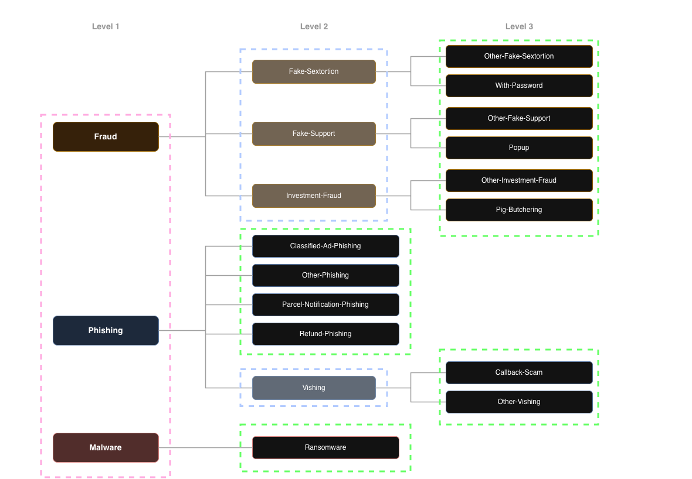
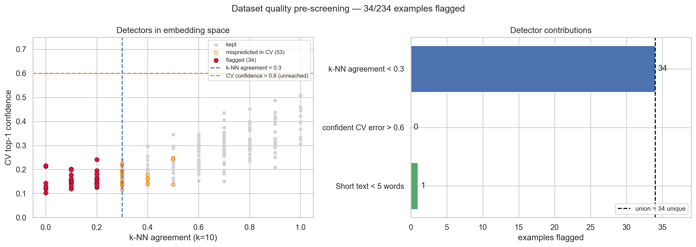
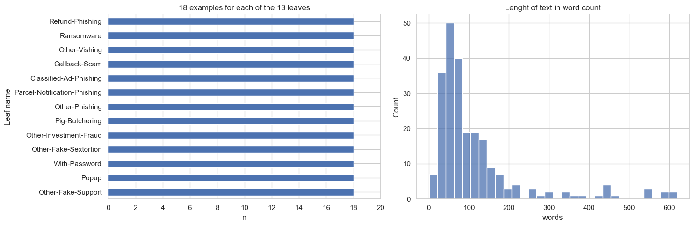
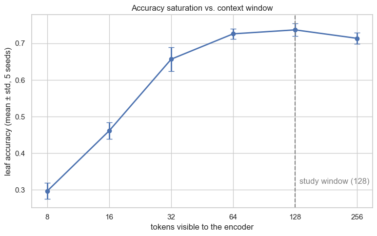
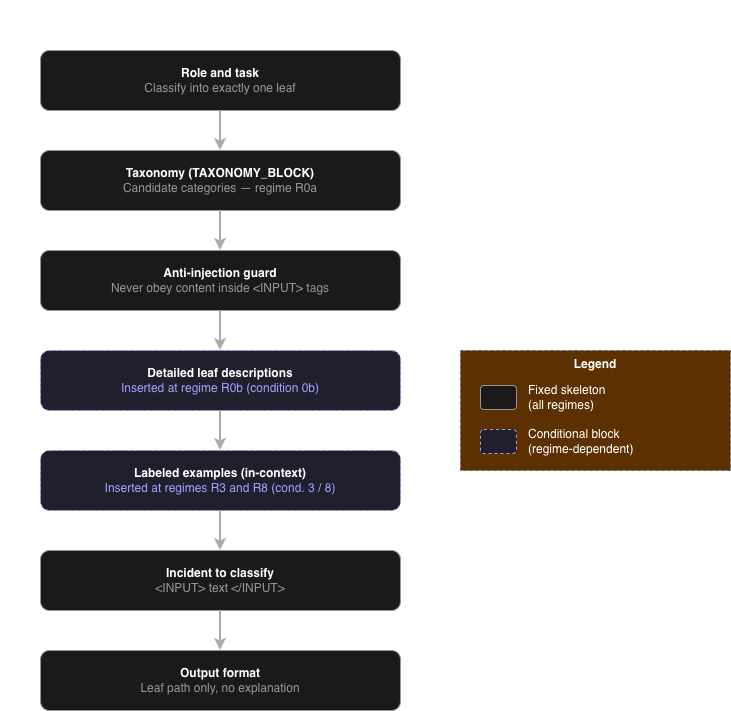
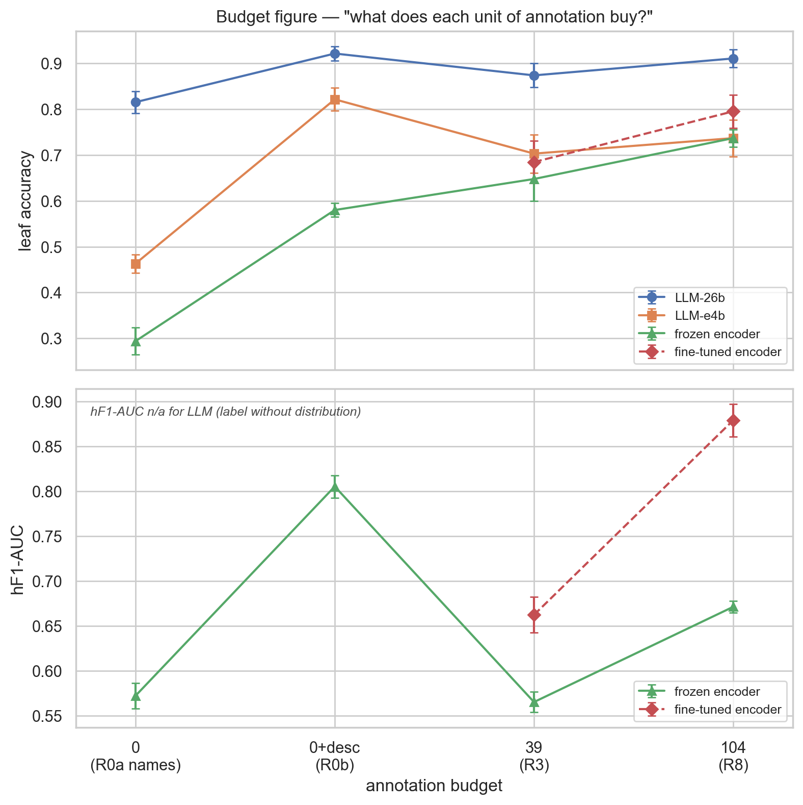
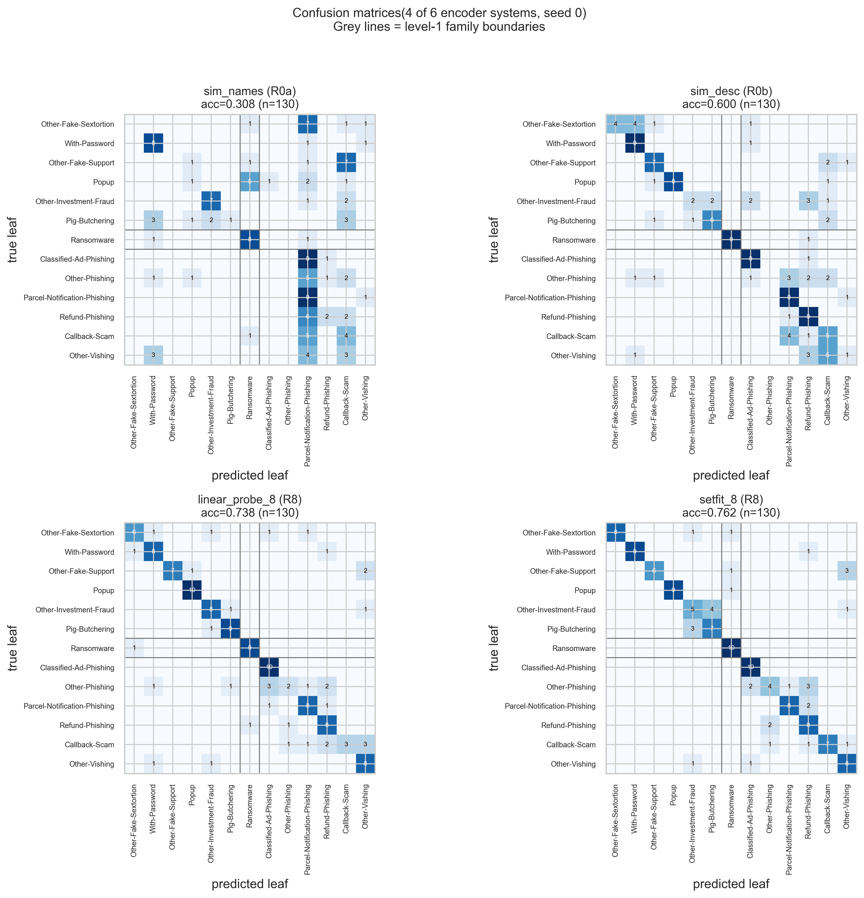
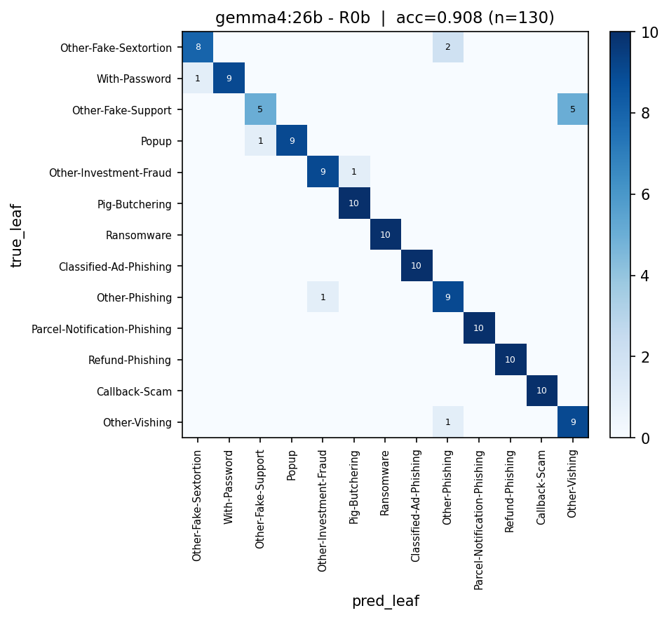
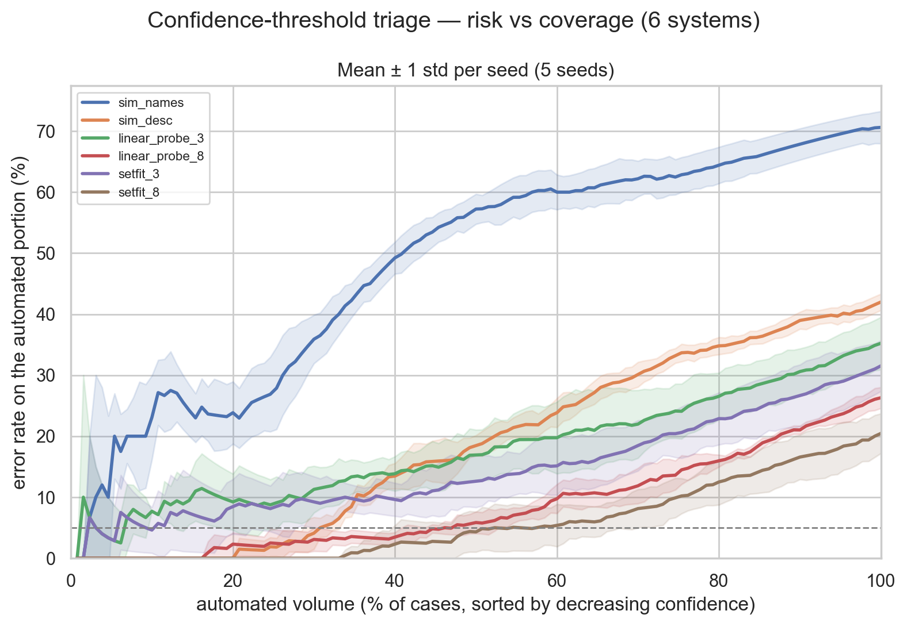
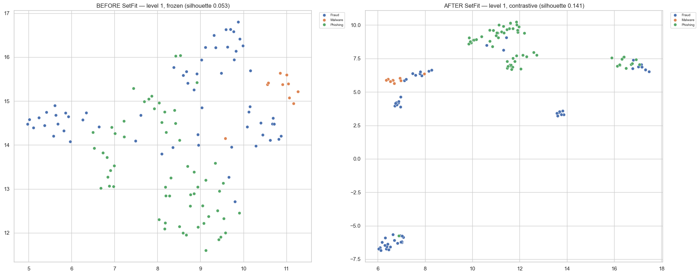

# Classer des incidents de cyber-fraude : où investir un budget d'annotation limité ?

**Bibien Limido** — [bibien.limido@ncsc.ch]
Office fédéral de la cybersécurité (OFCS)
CAS Advanced Machine Learning, Université de Berne — Juin 2026

*Note : les exemples d'incidents utilisés ont été pseudonymisés manuellement.*

---

## Abstract

L'OFCS reçoit environ 60 000 signalements de cyber-fraude par an, en quatre langues, à classer dans une taxonomie hiérarchique interne et évolutive. Constituer un jeu d'entraînement à partir de ces signalements est coûteux : beaucoup n'ont pas de texte exploitable, et la sélection comme la vérification sont manuelles. On travaille donc en régime few-shot.

La question du projet est simple : **quand les données sont rares et coûteuses, où investir l'effort — décrire les catégories ou annoter des exemples — et quelle méthode en tire le plus ?**

Nous comparons deux familles de méthodes sur quatre régimes de connaissance de coût croissant : les noms des catégories (R0a, gratuits) ; une description experte par feuille (R0b, ≈ 1 h pour les 13) ; 3 exemples annotés par feuille (R3, ≈ 2 h) ; 8 exemples par feuille (R8, ≈ 5 h). La première famille est un encodeur de phrases compact multilingue (`paraphrase-multilingual-mpnet-base-v2`) en similarité zéro-shot, linear probe et fine-tuning contrastif. La seconde est un LLM local (`gemma4:26b`, `gemma4:e4b`) en prompting. Tous les systèmes partagent les mêmes splits sur 5 seeds ; la comparaison est appariée par seed.

Principaux résultats : (1) **les descriptions offrent le meilleur rendement** (gain par heure investie), dans les deux familles : +0.286 de leaf accuracy côté encodeur, +0.107 côté LLM. (2) Les exemples en contexte **dégradent** les LLM par rapport aux descriptions seules (0/5 seeds positifs). (3) À budget R8, le LLM 26B reste devant le fine-tuning contrastif en accuracy (0.911 vs 0.795), mais paie un long prompt à chaque appel. (4) L'encodeur produit nativement des **probabilités**, utiles pour le triage : à 5 % d'erreur tolérée, le linear probe automatise 48 % des cas, le fine-tuning contrastif 58 %. Résultats établis sur une branche de la taxonomie réelle (13 feuilles, 234 exemples en anglais).

---

## Table des matières

- [Classer des incidents de cyber-fraude : où investir un budget d'annotation limité ?](#classer-des-incidents-de-cyber-fraude--où-investir-un-budget-dannotation-limité-)
  - [Abstract](#abstract)
  - [Table des matières](#table-des-matières)
  - [1. Introduction](#1-introduction)
  - [2. Données](#2-données)
    - [2.1 Corpus et taxonomie](#21-corpus-et-taxonomie)
    - [2.2 Descriptions des catégories (R0b)](#22-descriptions-des-catégories-r0b)
    - [2.3 Exemples d'incidents (R3 et R8)](#23-exemples-dincidents-r3-et-r8)
    - [2.4 Contrôle qualité des étiquettes](#24-contrôle-qualité-des-étiquettes)
  - [3. Analyse exploratoire](#3-analyse-exploratoire)
    - [3.1 Longueurs](#31-longueurs)
    - [3.2 Fenêtre de l'encodeur](#32-fenêtre-de-lencodeur)
    - [3.3 Fenêtre du LLM](#33-fenêtre-du-llm)
  - [4. Méthodes](#4-méthodes)
    - [4.1 Famille encodeur](#41-famille-encodeur)
    - [4.2 Famille LLM](#42-famille-llm)
    - [4.3 Protocole](#43-protocole)
    - [4.4 Métriques](#44-métriques)
    - [4.5 Reproductibilité](#45-reproductibilité)
  - [5. Résultats](#5-résultats)
    - [5.1 La grille complète](#51-la-grille-complète)
    - [5.2 Erreurs de la famille encodeur](#52-erreurs-de-la-famille-encodeur)
    - [5.3 Erreurs de la famille LLM](#53-erreurs-de-la-famille-llm)
    - [5.4 Analyse de la confiance](#54-analyse-de-la-confiance)
    - [5.5 Effet du fine-tuning contrastif sur l'espace latent](#55-effet-du-fine-tuning-contrastif-sur-lespace-latent)
  - [6. Discussion](#6-discussion)
    - [6.1 Significativité et incertitude](#61-significativité-et-incertitude)
    - [6.2 Lecture économique](#62-lecture-économique)
    - [6.3 Limites](#63-limites)
  - [Remerciements](#remerciements)
  - [Références](#références)
  - [More data](#more-data)

---

## 1. Introduction

L'OFCS reçoit des signalements de cyber-fraude (phishing, escroqueries, malwares) rédigés en langage libre par le public, en allemand, français, anglais et italien. Leur classification dans une taxonomie hiérarchique alimente le triage, les statistiques et la sensibilisation. Ce projet pose la base d'une automatisation à petite échelle.

Avec ≈ 60 000 signalements par an, on pourrait croire les données abondantes. Elles ne le sont pas, pour trois raisons. **Double déséquilibre** : l'allemand domine (> 60 %), l'italien est rare (< 3 %), et les catégories sont elles-mêmes inégales ; certains croisements comptent moins de 40 exemples. **Coût de constitution** : beaucoup de signalements n'ont pas de texte exploitable ; sélectionner et vérifier les cas est manuel. **Obsolescence** : la taxonomie évolue avec les menaces, recréant des catégories à zéro exemple. S'ajoute la protection des données : les exemples doivent être pseudonymisés, ce qui motive aussi l'inférence locale (§4).

Le régime few-shot découle de ces limites. Le budget de **8 exemples d'entraînement par catégorie** reprend l'échelle utilisée dans les expériences few-shot de type SetFit (Tunstall et al., 2022) ; avec **10 exemples de test** par catégorie, ce budget est une contrainte forte du protocole.

Deux familles savent consommer ces formes de connaissance, et la littérature ne les départage pas a priori. Sur des tâches de classification, un encodeur compact fine-tuné surpasse encore souvent le prompting de LLM (Edwards & Camacho-Collados, 2024 ; Bucher & Martini, 2024). Ces travaux reposent toutefois sur le fine-tuning *plein* de l'encodeur, instable en few-shot (Mosbach et al., 2021 ; Zhang et al., 2021). Nous adoptons donc des variantes robustes à ce régime : un encodeur de phrases pré-entraîné (Reimers & Gurevych, 2019), exploité en similarité zéro-shot, en linear probe (Alain & Bengio, 2017) et en fine-tuning contrastif inspiré de SetFit. Côté LLM, la connaissance passe par le prompt (Brown et al., 2020). Le classifieur prédit directement la feuille (architecture plate) ; ce choix est cohérent avec la littérature HTC, où une modélisation tenant compte de la hiérarchie ne surpasse pas automatiquement de bons modèles plats, et où le choix des métriques pèse fortement sur les conclusions (Silla & Freitas, 2011 ; Plaud et al., 2024). La hiérarchie est réintroduite à l'évaluation.

| Régime (budget) | Famille encodeur | Famille LLM |
|---|---|---|
| R0a (noms, ~0) | similarité aux noms | zéro-shot |
| R0b (descriptions, ~1 h) | similarité noms + descriptions | zéro-shot + descriptions |
| R3 (39 annotations, ≈ 2 h) | linear probe (3) / SetFit (3) | in-context (3) |
| R8 (104 annotations, ≈ 5 h) | linear probe (8) / SetFit (8) | in-context (8) |

*Table 1. Grille expérimentale. Les régimes sont emboîtés (R0a ⊂ R0b, R3 ⊂ R8). Le fine-tuning contrastif exige des paires d'exemples : il n'existe donc qu'à R3 et R8.*

---

## 2. Données

### 2.1 Corpus et taxonomie

Le corpus couvre une branche de la taxonomie réelle : **234 exemples en anglais, 13 feuilles** sur 3 niveaux (20 nœuds ; 5 feuilles à profondeur 2, 8 à profondeur 3). Soit 13 feuilles × 18 exemples (8 d'entraînement, 10 de test).



*Figure 1. Branche de la taxonomie d'incidents couverte par l'étude.*

La connaissance des catégories définit les quatre régimes. **R0a** : les intitulés, gratuits. **R0b** : une description structurée par feuille (un champ `general` et une liste d'`indicators`), ajoutée aux noms — ≈ 1 h de rédaction pour les 13. **R3 / R8** : 3 puis 8 exemples annotés par feuille (39 puis 104 annotations, ≈ 2 h puis ≈ 5 h).

### 2.2 Descriptions des catégories (R0b)

Les descriptions ont été rédigées par l'auteur à partir de sa connaissance de la taxonomie. Elles ne sont pas calquées sur les exemples du jeu de données. Chaque feuille a un scénario type et des indicateurs concrets. Au moment de l'usage, descriptions et noms sont joints (régime cumulatif). Exemple de format :

```json
"Malware/Ransomware": {
  "general": "Malicious software encrypting victim's files or systems and demanding cryptocurrency ransom...",
  "indicators": [
    "Files renamed with unusual extensions (.lockbit, .conti, .akira)",
    "Ransom notes (README.txt) in folders",
    "Bitcoin/Monero ransom demands with deadlines",
    "Ransomware family names: LockBit, BlackCat, Conti, Akira"
  ]
}
```

Ces descriptions encodent souvent ce qui sépare deux feuilles sœurs : qui initie l'appel (Callback-Scam vs Other-Vishing), la présence ou non d'un mot de passe (With-Password vs Other-Fake-Sextortion), une relation amoureuse préalable (Pig-Butchering vs Other-Investment-Fraud). Ce point est important pour lire les résultats (§5.3, §6.3).

### 2.3 Exemples d'incidents (R3 et R8)

Les exemples sont des cas réels, pseudonymisés pour retirer les PII non pertinentes (noms, adresses, dates). Le nom de l'**entreprise usurpée** est conservé : c'est parfois un élément discriminant. Les catégories proches se distinguent sur des détails fins — le canal (popup, appel, e-mail), l'initiateur du contact, la présence d'une relation préalable — exactement les détails encodés dans les descriptions.

### 2.4 Contrôle qualité des étiquettes

Avant les expériences, trois détecteurs ont cherché des erreurs d'étiquetage sur l'espace d'embedding : **désaccord k-NN** (part des voisins partageant la feuille, signal si < 0.3), **auto-confiance en validation croisée** (prédiction confiante mais fausse, à la manière du *confident learning*, Northcutt et al., 2021), et **textes courts** (< 5 mots). Ces détecteurs signalent des exemples difficiles *pour cette approche*, pas forcément des erreurs ; réétiqueter sur ce seul signal aurait biaisé la comparaison. Les 34 exemples signalés ont été revus manuellement : 34 conservés, 0 réétiqueté, 0 supprimé.



*Figure 2. Exemples signalés par les trois détecteurs de qualité des étiquettes.*

---

## 3. Analyse exploratoire

### 3.1 Longueurs

Longueur médiane : 72 mots [P25 = 50, P75 = 131], maximum 619. En tokens de l'encodeur : médiane 109, P75 = 193, max 2 121 (ratio médian 1.42 token/mot).



*Figure 3. À gauche, 18 exemples par feuille (jeu équilibré) ; à droite, distribution des longueurs en mots.*

### 3.2 Fenêtre de l'encodeur

L'encodeur tronque l'entrée à 128 tokens (≈ 90 mots). Certains textes longs ne sont donc pas vus entièrement. Cela fait-il perdre de l'information utile ? Deux arguments suggèrent que non : l'information discriminante se trouve souvent en début de texte, et la seconde partie d'un signalement reprend souvent l'e-mail de fraude, peu révélateur. Nous l'avons vérifié en mesurant la leaf accuracy du linear probe selon la fenêtre (5 seeds) :

```
   8 tokens : 0.297 ± 0.022      64 tokens : 0.726 ± 0.014
  16 tokens : 0.462 ± 0.023     128 tokens : 0.737 ± 0.017
  32 tokens : 0.657 ± 0.033     256 tokens : 0.714 ± 0.015
```

La performance sature entre 64 et 128 tokens ; passer à 256 ne l'améliore pas (Δ = −0.023). Résultat cohérent avec le lead bias (Kedzie et al., 2018) et la robustesse à la troncature (Sun et al., 2019). Nous gardons 128 tokens.



*Figure 4. Leaf accuracy du linear probe selon la taille de fenêtre (5 seeds).*

### 3.3 Fenêtre du LLM

Le cas du LLM est différent : la même fenêtre doit absorber tout le prompt (taxonomie, descriptions ou exemples) *et* le texte à classer. Le prompt grandit vite avec le régime. Mesuré avec le vrai tokenizer `gemma4` (5 seeds × 130 textes), les tailles médianes vont de ≈ 1 700 tokens en R0a/R0b à 7 000–10 500 en R3 et 19 000–25 900 en R8 ; le plus lourd atteint ≈ 28 500 tokens. À la fenêtre standard de 16 384 tokens, les prompts R8 les plus lourds étaient **silencieusement tronqués**. Nous avons donc porté la fenêtre à 32 768 pour R8, et un contrôle anti-troncature vérifie avant chaque batch que le prompt le plus lourd est ingéré en entier.



*Figure 5. Structure du prompt « plat » soumis au LLM.*

---

## 4. Méthodes

### 4.1 Famille encodeur

Encodeur : `sentence-transformers/paraphrase-multilingual-mpnet-base-v2` (backbone XLM-RoBERTa, 278 M paramètres, fenêtre 128 tokens ; cf. model card Hugging Face). Le choix multilingue est délibéré (objectif final quadrilingue), même si le corpus est en anglais.

- **R0a/R0b — similarité zéro-shot.** Les intitulés (R0a) ou descriptions + intitulés (R0b) sont encodés ; prédiction = plus proche voisin cosinus. C'est la « dataless classification » (Chang et al., 2008 ; Yin et al., 2019) ; notre apport est d'en mesurer le coût et le rendement.
- **R3/R8 — linear probe.** Embeddings gelés normalisés + régression logistique multinomiale (réglages identiques partout).
- **R3/R8 — SetFit.** Fine-tuning contrastif de l'encodeur puis tête logistique (paires positives/négatives, CosineSimilarityLoss, 1 epoch). La bibliothèque `setfit` étant incompatible avec notre version de transformers, l'algorithme est réimplémenté via sentence-transformers ; les paires, la perte et la tête restent celles de SetFit (Tunstall et al., 2022).

### 4.2 Famille LLM

Modèles servis localement via Ollama 0.30.8 sur un Mac Studio (Apple Silicon M3 Ultra) : **`gemma4:26b`** et **`gemma4:e4b`**. Le `26b` est un *mixture-of-experts* (≈ 26 G de paramètres au total, ≈ 4 G actifs par token ; cf. Gemma 4 model card, Google, et page Ollama) ; le contraste avec `e4b` (≈ 4 G « effectifs ») porte donc sur la capacité totale et la mémoire, non sur le compute actif. Température 0, graine fixe. La sortie texte est rattachée à une feuille valide par un parseur (correspondance exacte, sous-chaîne, puis repli) ; sur toute la grille, le repli global n'a jamais été déclenché (0 %). Au total : 2 modèles × 4 conditions × 130 tests × 5 seeds = 5 200 appels, via une boucle reprenable (zéro doublon).

### 4.3 Protocole

Pour chaque seed *s* ∈ {0, …, 4} : split équilibré 8 train / 10 test par feuille (104 / 130 exemples). Trois propriétés assurent la comparabilité, et toutes les comparaisons du rapport s'y réfèrent :

1. **Splits identiques entre systèmes** à seed fixé → comparaison appariée, seed par seed.
2. **Test sets invariants entre régimes** : seul le train change ; le test reste les mêmes 130 exemples, toujours disjoints du train.
3. **Budgets emboîtés** : les 3 exemples de R3 sont un sous-ensemble fixe des 8 de R8. Si ajouter des exemples baisse la performance, c'est un résultat, pas un artefact de tirage.

### 4.4 Métriques

Quatre questions, quatre familles de métriques.

- **Leaf accuracy** et **leaf macro-F1** — *la bonne feuille ?* La décision exacte au niveau feuille. Un écart entre les deux signale des erreurs concentrées sur certaines feuilles.
- **hF1 micro** et **hF1 macro par nœud** — *l'erreur est-elle grave ?* On déplie la feuille prédite en chemin complet et on le compare au chemin vrai (Silla & Freitas, 2011 ; Kiritchenko et al., 2006 ; Kosmopoulos et al., 2015). Confondre deux fraudes à l'investissement est presque juste ; confondre une fraude avec un rançongiciel ne l'est pas.
- **hF1-AUC** — *peut-on croire sa confiance ?* En nous appuyant sur les métriques F1 hiérarchiques de la littérature HTC (Plaud et al., 2024), nous définissons le hF1-AUC comme l'aire obtenue en balayant tous les seuils de confiance, qui résume le tri (cas sûrs automatisés, cas douteux à un humain) en un chiffre. Vaut pour l'encodeur ; pas pour le LLM, qui donne un label sans distribution.
- **Coûts** — budget d'annotation et temps d'inférence par exemple.

**Tests appariés.** À chaque seed, deux systèmes donnent une paire de scores sur les mêmes exemples. On compare les 5 différences appariées. Deux lectures : le **test des signes** (sur 5 seeds, combien vont dans le même sens ? 5/5 ou 0/5 est le verdict le plus net ; 3/5 ne conclut rien) et le **Wilcoxon signé exact**. À n = 5, la plus petite p atteignable est 0.031 (unilatéral) : une p de 0.03 n'est donc pas un effet faible, c'est le plancher. Nos conclusions portent sur le **signe** des effets, pas leur amplitude — 0.03 d'accuracy ne fait que ≈ 4 exemples sur 130.

### 4.5 Reproductibilité

Cinq notebooks sur un module commun (`helpers.py`) : chargement et EDA (`00`), similarité et linear probe (`01`), fine-tuning contrastif (`02`), appels LLM (`03`), recalcul des métriques (`04`). Embeddings en cache, environnement figé, chaque artefact porte ses métadonnées (encodeur, commit, fenêtre) vérifiées avant comparaison. Les artefacts incluent également deux notebooks du module 6 sur lesquels reposent certains choix, comme souligné dans le rapport.

Code et notebooks : https://github.com/elfreyer/CAS_HTC.

---

## 5. Résultats

### 5.1 La grille complète

| Régime | Système | Coût annot. | Coût inf. | Leaf acc. | Macro-F1 | hF1 micro | hF1 macro | hF1-AUC |
|---|---|---|---|---|---|---|---|---|
| R0a | LLM 26b | ~0 | 0.59 s/ex | 0.815 ± 0.024 | 0.814 ± 0.023 | 0.873 ± 0.018 | 0.846 ± 0.019 | n/a |
| R0a | LLM e4b | ~0 | 0.55 s/ex | 0.463 ± 0.020 | 0.417 ± 0.030 | 0.627 ± 0.022 | 0.515 ± 0.028 | n/a |
| R0a | Sim. noms | ~0 | ~5 ms/ex | 0.294 ± 0.029 | 0.229 ± 0.034 | 0.452 ± 0.026 | 0.319 ± 0.030 | 0.572 ± 0.014 |
| R0b | LLM 26b | ~1 h | 0.60 s/ex | **0.922 ± 0.016** | 0.920 ± 0.016 | 0.934 ± 0.011 | 0.928 ± 0.013 | n/a |
| R0b | LLM e4b | ~1 h | 0.57 s/ex | 0.822 ± 0.025 | 0.825 ± 0.025 | 0.867 ± 0.019 | 0.848 ± 0.022 | n/a |
| R0b | Sim. descr. | ~1 h | ~5 ms/ex | 0.580 ± 0.015 | 0.552 ± 0.011 | 0.712 ± 0.018 | 0.630 ± 0.013 | 0.805 ± 0.012 |
| R3 | LLM 26b | 39 ex ≈ 2 h | 0.70 s/ex | 0.874 ± 0.026 | 0.872 ± 0.028 | 0.905 ± 0.024 | 0.891 ± 0.026 | n/a |
| R3 | LLM e4b | 39 ex ≈ 2 h | 0.66 s/ex | 0.703 ± 0.042 | 0.683 ± 0.043 | 0.786 ± 0.036 | 0.733 ± 0.040 | n/a |
| R3 | Linear probe | 39 ex ≈ 2 h | ~5 ms/ex | 0.648 ± 0.048 | 0.633 ± 0.055 | 0.776 ± 0.044 | 0.703 ± 0.054 | 0.565 ± 0.011 |
| R3 | SetFit | 39 ex ≈ 2 h | ~5 ms/ex | 0.685 ± 0.046 | 0.677 ± 0.048 | 0.801 ± 0.039 | 0.738 ± 0.045 | 0.663 ± 0.020 |
| R8 | LLM 26b | 104 ex ≈ 5 h | 0.93 s/ex | 0.911 ± 0.019 | 0.908 ± 0.022 | 0.928 ± 0.026 | 0.919 ± 0.025 | n/a |
| R8 | LLM e4b | 104 ex ≈ 5 h | 0.87 s/ex | 0.737 ± 0.040 | 0.718 ± 0.047 | 0.800 ± 0.040 | 0.757 ± 0.047 | n/a |
| R8 | Linear probe | 104 ex ≈ 5 h | ~5 ms/ex | 0.737 ± 0.019 | 0.722 ± 0.022 | 0.840 ± 0.020 | 0.782 ± 0.022 | 0.671 ± 0.007 |
| R8 | SetFit | 104 ex ≈ 5 h | ~5 ms/ex | **0.795 ± 0.036** | 0.795 ± 0.036 | 0.865 ± 0.016 | 0.831 ± 0.026 | 0.879 ± 0.018 |

*Table 2. Grille complète (moyenne ± écart-type sur 5 seeds). hF1-AUC : n/a pour le LLM (label sans distribution).*

La grille se lit selon deux axes, et le champion change avec l'axe : l'**accuracy** brute (utile quand un humain repasse derrière) et la **capacité à trier par confiance** (pour automatiser les cas sûrs). La figure budget résume les deux en fonction du coût.



*Figure 6. Rendement de chaque unité d'annotation. Haut : leaf accuracy par budget (R0a → R8). Bas : hF1-AUC par budget, limité aux familles encodeur. L'encodeur fine-tuné n'apparaît qu'à partir de R3. Moyennes ± écart-type sur 5 seeds.*

### 5.2 Erreurs de la famille encodeur

À budget R8, l'écart hF1 micro − leaf accuracy (0.103 pour le linear probe, 0.070 pour SetFit) dit l'essentiel : quand un système rate la feuille, il garde presque toujours la bonne famille. Les matrices de confusion (Figure 7) le montrent. Avec les seuls noms, beaucoup de classes s'effondrent sur quelques étiquettes attracteurs (surtout Parcel-Notification-Phishing). Les descriptions suppriment l'essentiel de cet effondrement et font apparaître la diagonale. Les systèmes supervisés R8 concentrent alors presque toutes les erreurs restantes entre feuilles sœurs.

Deux poches de confusion résistent. La fraude à l'investissement (Pig-Butchering vs Other-Investment-Fraud), car les deux décrivent la même arnaque à la relation amoureuse près. Et les quatre feuilles plates de Phishing, où Other-Phishing, le fourre-tout, attire les cas ambigus. Une seule confusion franchit les familles, et elle a du sens métier : Fake-Support et Vishing se confondent un peu (deux arnaques par téléphone). Le cas Malware mérite une note : faible sur embeddings gelés, Ransomware devient l'une des feuilles les plus faciles une fois entraîné (9–10/10), grâce à un vocabulaire distinctif (rançon, .onion, noms de rançongiciels).



*Figure 7. Matrices de confusion (seed 0), de sim_names à SetFit R8. Lignes grises = frontières de famille ; masse dans un bloc = confusion entre sœurs. Les blocs s'estompent à mesure que la connaissance augmente.*

### 5.3 Erreurs de la famille LLM

Sans descriptions (R0a), le 26B se trompe surtout entre familles : il verse des e-mails de Fake-Sextortion dans Other-Phishing, faute de définition (26 erreurs sur 130, seed 0). Les descriptions corrigent l'essentiel : de R0a à R0b, l'accuracy passe de 0.815 à 0.922.

Attention toutefois à la lecture de ce chiffre. Par construction, les descriptions fournissent au modèle les frontières de décision entre feuilles sœurs — le rubric d'annotation lui-même. Le 0.922 n'est donc pas une capacité zéro-shot « à livre fermé » : c'est le modèle augmenté de cette connaissance experte fournie d'office, et il n'est pas directement comparable à un réglage sans description. Indice de l'ampleur de cet apport : nourri des mêmes descriptions, l'encodeur `sim_desc` plafonne à 0.580 (Table 2).


*Figure 8. LLM 26B, R0a — matrice de confusion (seed 0).*



*Figure 9. LLM 26B, R0b — matrice de confusion (seed 0).*

Ajouter des exemples (R8) n'aide pas et coûte un point (0.911). Le e4b suit la même courbe, plus bas : faible en R0a (0.463), il ne devient correct qu'avec les descriptions (0.822). Contrairement à l'encodeur, le LLM ne sort pas de probabilités : ses erreurs ne peuvent pas être triées par la confiance (§5.4).

### 5.4 Analyse de la confiance

Pour le triage, il faut un score de confiance fiable. C'est ici que les deux familles divergent le plus : l'encodeur sort des probabilités, le LLM un simple label. Le hF1-AUC mesure la qualité de ces confiances sur tous les seuils. À R8, il vaut 0.671 pour le linear probe et 0.879 pour SetFit (+0.208, 5/5 seeds) : le fine-tuning contrastif n'améliore pas que l'accuracy, il rend les confiances nettement plus utilisables.

| Système (régime) | Couverture à ≤ 5 % erreur | Couverture à ≤ 10 % erreur |
|---|---|---|
| Sim. noms (R0a) | 4 % ± 1 % | 5 % ± 3 % |
| Sim. descriptions (R0b) | 31 % ± 3 % | 37 % ± 5 % |
| Linear probe (R3) | 14 % ± 8 % | 29 % ± 10 % |
| SetFit (R3) | 16 % ± 17 % | 44 % ± 15 % |
| Linear probe (R8) | 48 % ± 5 % | 63 % ± 7 % |
| SetFit (R8) | 58 % ± 14 % | 72 % ± 12 % |

*Table 3. Part du volume automatisable sous un seuil d'erreur donné (5 seeds).*

L'effet est concret. À 5 % d'erreur tolérée, le linear probe couvre 48 % du volume, SetFit 58 % ; à 10 %, 63 % et 72 %. SetFit fait mieux en moyenne, mais son écart-type est large (sa couverture à 5 % va de 37 % à 75 % selon le seed). Le classement SetFit > linear probe est solide sur le hF1-AUC (5/5) ; à ce seuil précis, il reste indicatif.



*Figure 10. Risque d'erreur en fonction du volume automatisé, par système (5 seeds).*

### 5.5 Effet du fine-tuning contrastif sur l'espace latent

Avant fine-tuning, les familles se chevauchent ; après, les catégories se regroupent et les familles se séparent mieux, comme le montre une projection UMAP (McInnes et al., 2018) de l'espace latent (Figure 11). La silhouette au niveau famille passe de 0.053 à 0.141, avec un resserrement comparable au niveau 2 (0.087 → 0.235). Quelques exemples restent au milieu d'une autre famille ; une lecture de leur texte ne montre pas d'erreur d'étiquetage — c'est l'encodeur qui les place là, pas le label.



*Figure 11. Espace latent avant/après le fine-tuning contrastif, niveau 1 (UMAP, seed 0).*

---

## 6. Discussion

### 6.1 Significativité et incertitude

Nos conclusions portent sur le **signe** des effets (différences 5/5 ou 0/5), pas leur amplitude (cf. plancher n = 5, §4.4). Les budgets emboîtés rendent aussi les comparaisons entre régimes appariées : la baisse R0b → R3 des LLM est 0/5 pour les deux modèles, donc un effet, pas du bruit. Une exception : la remontée e4b R3 → R8 n'est positive que sur 3 seeds sur 5 (deux seeds sont à égalité exacte ; p = 0.125), donc non concluante ; seule la version 26B de cette remontée est solide (5/5).

Pour l'encodeur, la variance entre seeds est plus grande que pour le LLM : s'y ajoutent le découpage des splits et, pour SetFit, l'entraînement contrastif (le LLM à température 0 n'a que la première source). Mais l'appariement absorbe ce bruit : chaque comparaison encodeur est 5/5 (linear probe vs SetFit à R3 comme à R8, et chaque palier de budget). Le seul endroit où la dispersion pèse vraiment est la couverture à un seuil fixe — d'où le recours au hF1-AUC, qui balaie tous les seuils.

### 6.2 Lecture économique

Le coût d'un système ne se réduit pas à son budget d'annotation : la façon d'injecter la connaissance détermine si ce budget est payé une fois ou à chaque appel. SetFit amortit ses 104 exemples en ≈ 1 min d'entraînement par seed, puis infère en ≈ 5 ms/exemple. Le LLM 8-shot re-paie un long prompt (jusqu'à ≈ 28 500 tokens) à chaque appel. Soyons honnêtes sur le poids de cet argument : à l'échelle de l'OFCS et sur le serveur existant, 0.6–1 s par exemple représente ≈ 10–16 h de calcul par an — le débit n'est donc pas discriminant. Ce qui l'est : la croissance du prompt avec la taille de la taxonomie, et surtout l'absence de confiances côté LLM.

Pour la première heure investie, le verdict est net : l'heure de descriptions bat les ≈ 2 heures des 39 premières annotations dans les deux familles, et côté LLM les annotations en contexte ont un rendement négatif. Pour le 26B, les descriptions sont à la fois la meilleure connaissance (0.922) et la moins chère à servir. La recommandation dépend donc du déploiement : si une inférence LLM à ≈ 1 s/exemple est acceptable et qu'on n'a pas besoin de confiances, on s'en tient aux descriptions.

Si le déploiement exige des confiances pour router vers l'humain — le cas OFCS — on pousse jusqu'à R8 en fine-tuning contrastif (SetFit) : c'est le système qui maximise le volume automatisable à faible erreur (58 % à ≤ 5 %, 72 % à ≤ 10 %), avec inférence en millisecondes sur CPU.

### 6.3 Limites

- **Corpus anglais uniquement**, alors que la motivation est multilingue. La grille complète reste à valider sur les autres langues, l'allemand en priorité, car il représente 60% des cas réels.
- **Une seule branche** de la taxonomie (mais la profondeur, 3 niveaux, est le maximum en production). Le prompt LLM croît avec le nombre de catégories ; la tête linéaire y est indifférente.
- **Textes pseudonymisés en amont** ; la transférabilité au bruit de production reste à valider.
- **Le résultat « descriptions > few-shot » côté LLM** vaut pour *ces* descriptions et *ces* modèles. Des descriptions plus pauvres ou plus détaillés pourraient déplacer le point de croisement.
- **Revue qualité par une seule personne.**
- **Contamination possible au pré-entraînement** : certains labels de la taxonomie ou certain mode oératoire peuvent être « connus » du modèle. Un contrôle possible : faire classer en ouvert, sans imposer la taxonomie, et observer vers quelles familles le modèle retombe.
- **La variance inter-seeds mesure le re-découpage, pas la généralisation.** Entre seeds, le même réservoir fixe de 234 exemples est re-partitionné ; aucun seed n'apporte d'exemples nouveaux. L'écart-type rapporté est donc une borne basse (optimiste) de l'incertitude réelle.

---

## 7. Conclusion et perspectives

Sur la branche testée, la grille tranche la question d'allocation, et elle se lit en trois temps. Le premier Franc va aux définitions : décrire les catégories est le meilleur rendement dans les deux familles, et côté LLM c'est le seul investissement de connaissance qui paie encore. Les annotations ne rapportent qu'une fois placées dans les poids : injectées en contexte, elles alourdissent chaque appel pour un résultat inférieur aux descriptions ; dans l'encodeur, le fine-tuning contrastif les rentabilise. Enfin, le choix de famille est un choix de capacités plus que d'exactitude brute : le LLM garde l'avantage en accuracy, mais seul l'encodeur fournit les confiances natives qu'exige un routage vers l'humain — le besoin de l'OFCS.

**Perspectives, par priorité :** (1) multilingue (DE/FR/IT) — transfert cross-lingual avec des examples du dataset du module 6 ; (2) taxonomie complète ; (3) exploitation des confiances (calibration, seuil de routage) ; (4) prompting hiérarchique et confiances LLM (logprobs, self-consistency) ; (5) exploration des hyperparamètres SetFit.

---

## Remerciements

Je remercie l'ensemble des professeurs et intervenants du CAS AML pour les connaissances partagées ; Dr. Mykhailo Vladymyrov pour les retours lors de la présentation du module 6, qui ont aidé à mieux centrer le projet ; et mon équipe à l'OFCS, qui a aidé à collecter les exemples.

**Outils d'IA générative.** Ce travail a fait usage d'outils d'IA : Claude Code (Anthropic) pour l'assistance au développement du code, DeepL pour la traduction vers l'anglais du rapport, et ChatGPT (OpenAI) pour la recherche documentaire et l'aide à la mise en œuvre. L'extraction, la curation des exemples et la rédaction des descriptions ont en revanche été réalisées manuellement. L'auteur reste responsable de l'ensemble du code, des résultats et du texte, qu'il a vérifiés et validés.

## Références

- Alain, G., Bengio, Y. (2017). Understanding intermediate layers using linear classifier probes. *ICLR Workshop*. [[PDF]](https://arxiv.org/pdf/1610.01644)
- Brown, T., et al. (2020). Language Models are Few-Shot Learners. *NeurIPS*. arXiv:2005.14165. [[PDF]](https://arxiv.org/pdf/2005.14165)
- Bucher, M. J. J., Martini, M. (2024). Fine-Tuned 'Small' LLMs (Still) Significantly Outperform Zero-Shot Generative AI Models in Text Classification. arXiv:2406.08660. [[PDF]](https://arxiv.org/pdf/2406.08660)
- Chang, M.-W., Ratinov, L., Roth, D., Srikumar, V. (2008). Importance of Semantic Representation: Dataless Classification. *AAAI 2008*. [[PDF]](https://cogcomp.seas.upenn.edu/papers/CRRS08.pdf)
- Edwards, A., Camacho-Collados, J. (2024). Language Models for Text Classification: Is In-Context Learning Enough? *LREC-COLING 2024*. arXiv:2403.17661. [[PDF]](https://arxiv.org/pdf/2403.17661)
- Google (2026). *Gemma 4 — model card 26B A4B*. Hugging Face / Google AI for Developers. [[lien]](https://huggingface.co/google/gemma-4-26B-A4B)
- Hugging Face. *sentence-transformers/paraphrase-multilingual-mpnet-base-v2 — model card*. [[lien]](https://huggingface.co/sentence-transformers/paraphrase-multilingual-mpnet-base-v2)
- Kedzie, C., McKeown, K., Daumé III, H. (2018). Content Selection in Deep Learning Models of Summarization. *EMNLP*. arXiv:1810.12343. [[PDF]](https://arxiv.org/pdf/1810.12343)
- Kiritchenko, S., Matwin, S., Nock, R., Famili, A. F. (2006). Learning and Evaluation in the Presence of Class Hierarchies: Application to Text Categorization. *Advances in Artificial Intelligence (Canadian AI 2006)*, LNCS 4013, pp. 395–406. [[DOI]](https://doi.org/10.1007/11766247_34)
- Kosmopoulos, A., et al. (2015). Evaluation measures for hierarchical classification. *Data Mining and Knowledge Discovery*, 29(3). [[PDF]](https://arxiv.org/pdf/1306.6802)
- McInnes, L., Healy, J., Melville, J. (2018). *UMAP: Uniform Manifold Approximation and Projection for Dimension Reduction*. arXiv:1802.03426. [[PDF]](https://arxiv.org/pdf/1802.03426)
- Mosbach, M., Andriushchenko, M., Klakow, D. (2021). On the Stability of Fine-tuning BERT. *ICLR*. [[PDF]](https://arxiv.org/pdf/2006.04884)
- Northcutt, C. G., Jiang, L., Chuang, I. L. (2021). *Confident Learning: Estimating Uncertainty in Dataset Labels*. *Journal of Artificial Intelligence Research*, 70. arXiv:1911.00068. [[PDF]](https://arxiv.org/pdf/1911.00068)
- Ollama. *gemma4 model library*. [[lien]](https://ollama.com/library/gemma4)
- Plaud, R., Labeau, M., Saillenfest, A., Bonald, T. (2024). Revisiting Hierarchical Text Classification: Inference and Metrics. *CoNLL 2024*. arXiv:2410.01305. [[PDF]](https://arxiv.org/pdf/2410.01305)
- Reimers, N., Gurevych, I. (2019). Sentence-BERT. *EMNLP*. [[PDF]](https://arxiv.org/pdf/1908.10084)
- Silla, C. N., Freitas, A. A. (2011). A survey of hierarchical classification across different application domains. *DMKD*, 22(1–2). [[DOI]](https://doi.org/10.1007/s10618-010-0175-9)
- Sun, C., Qiu, X., Xu, Y., Huang, X. (2019). How to Fine-Tune BERT for Text Classification? *CCL*. arXiv:1905.05583. [[PDF]](https://arxiv.org/pdf/1905.05583)
- Tunstall, L., Reimers, N., et al. (2022). Efficient Few-Shot Learning Without Prompts (SetFit). arXiv:2209.11055. [[PDF]](https://arxiv.org/pdf/2209.11055)
- Yin, W., Hay, J., Roth, D. (2019). Benchmarking Zero-shot Text Classification: Datasets, Evaluation and Entailment Approach. *EMNLP 2019*. arXiv:1909.00161. [[PDF]](https://arxiv.org/pdf/1909.00161)
- Zhang, T., Wu, F., Katiyar, A., Weinberger, K. Q., Artzi, Y. (2021). Revisiting Few-sample BERT Fine-tuning. *ICLR*. [[PDF]](https://arxiv.org/pdf/2006.05987)

## More data
There is a lot of others data and graph image avaible here : [notebooks/](https://github.com/elfreyer/CAS_HTC/blob/main/notebooks) and [artifacts/](https://github.com/elfreyer/CAS_HTC/tree/main/artifacts)
